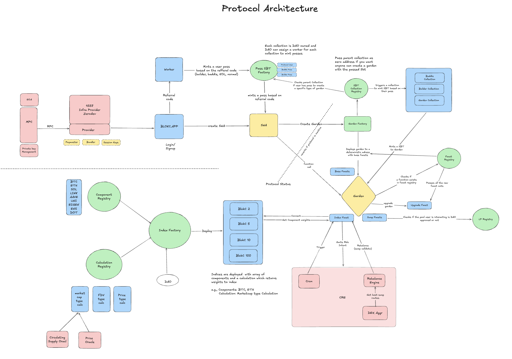

## Blokc V1 Core

Core smart contracts for **Blok Capital’s** v1 protocol.

This repository contains the diamond‑based core of Blok Capital: modular, upgradeable DeFi investment vehicles (“Gardens”) that can be composed from a curated set of protocol integration facets. It is intended to be the canonical on‑chain implementation that other Blok Capital components integrate with.

---

### Architecture

- **Gardens** – User‑specific, upgradeable investment vehicles implemented as **Diamond proxies (EIP‑2535)**.
- **Garden Factory** – Deterministically deploys Gardens via `CREATE2` (up to 10 Gardens per user).
- **Index System** – Configurable index contracts and rebalance logic (e.g. market‑cap weighted).
- **Facet Registry** – Single source of truth for allowed facets and function selectors.
- **Protocol Status** – Controls protocol lifecycle and upgradeability via an ENS‑based security council.
- **Pool & Protocol Registries** – Central registries for pools and supported protocol integrations.

The architecture is designed for **composability, security, and upgradeability**, while keeping each protocol integration isolated in its own facet.

---

### Tech Stack

- **Language**: Solidity `^0.8.31`
- **Framework**: [Foundry](https://book.getfoundry.sh/) (`forge`, `cast`, `anvil`)
- **Core Patterns**:
  - Diamond Standard (EIP‑2535)
  - Diamond storage per facet
  - Deterministic deployments with `CREATE2`
- **Dependencies** (via `lib/` and `remappings.txt`), including:
  - OpenZeppelin Contracts & Upgradeable
  - Uniswap V3 Core & Periphery (`@uniswap/v3-core` as in [`Uniswap/v3-core`](https://github.com/Uniswap/v3-core))
  - Aave V3
  - Pendle V2
  - Forge Std and other Foundry tooling

---

### Local Development

#### Prerequisites

- [Foundry](https://book.getfoundry.sh/getting-started/installation) installed (`forge`, `cast`, `anvil`)
- `git` (with submodule support)
- A modern version of `bash`/`zsh`

#### Clone & Setup

```bash
git clone --recursive https://github.com/BLOKCapital/blokc-v1-core
cd blokc-v1-core

# If you forgot --recursive
git submodule update --init --recursive
```

#### Build

```bash
forge build
# or to see contract sizes
forge build --sizes
```

#### Format

```bash
forge fmt
```

---
### Tests

Tests are written using **Foundry**’s native Solidity test framework.

```bash
# run all tests
forge test

# verbose output
forge test -vvv

# run a specific test file
forge test --match-path test/<TestFile>.sol
```

In CI, the `ci` profile is used (higher fuzzing runs and verbosity).

---

### Deployment

Deployment is handled via Forge scripts in `script/`.

Deploy on Anvil:

```bash
# 1. Start a local node (for local testing)
anvil

# 2. Run deploy script against a network
forge script script/deploy/arbitrumOne/Deploy.s.sol:Deploy \
  --rpc-url $RPC_URL_ANVIL \
  --private-key $PRIVATE_KEY_ANVIL \
  --broadcast
```

Deploy on Arbitrum: 

```bash
forge script script/deploy/Deploy.s.sol \
  --rpc-url $RPC_URL_ARBITRUM \
  --private-key $PRIVATE_KEY_ARBITRUM \
  --broadcast \
  --verify \
  --etherscan-api-key $API_KEY_ETHERSCAN
```

To resume verification if contracts are deployed but not verified:

```bash
forge script script/deploy/Deploy.s.sol \
  --rpc-url $RPC_URL_ARBITRUM \
  --private-key $PRIVATE_KEY_ARBITRUM \
  --broadcast \
  --resume \
  --verify \
  --etherscan-api-key $API_KEY_ETHERSCAN
```

---

### Using Solidity Interfaces

Public interfaces for external consumers live under `src/interfaces/` and are intended to be imported by other smart contracts.

Example:

```solidity
import { ILiquidityPoolRegistry } from "src/interfaces/ILiquidityPoolRegistry.sol";

contract MyStrategy {
    ILiquidityPoolRegistry public immutable liquidityPoolRegistry;

    constructor(ILiquidityPoolRegistry _liquidityPoolRegistry) {
        liquidityPoolRegistry = _liquidityPoolRegistry;
    }
}
```

Consumers should rely on these interfaces rather than concrete contract implementations wherever possible.

---

### Environment Variables

Environment variables are consumed by the Forge scripts. At minimum you will need:

- `PRIVATE_KEY` – Deployer private key (hex, 32 bytes).
- `RPC_URL` - RPC URL of the chain you're deploying.
- `SALT` – `bytes32` salt for `CREATE2` deployments.
- `API_KEY_ETHERSCAN` - Etherscan API key for verifying contracts on block scanners.

Example `.env` (do **not** commit this file):

```bash
PRIVATE_KEY=0x...
SALT=0x...
API_KEY_ETHERSCAN=...
RPC_URL=https://...
```

---

### Key Concepts & Patterns

- **Diamond Proxy (EIP‑2535)**:  
  Gardens are implemented as diamonds with:
  - Base facets for core diamond operations (cut, loupe, ownership, upgrade).
  - Utility facets for protocol integrations and ancillary functionality.

- **Facet Registry**:  
  Central registry that tracks valid facets and their function selectors, adding an extra layer of safety to upgrades and integrations.

- **Protocol Status**:  
  Global protocol state machine (e.g. ACTIVE, INACTIVE, UPGRADES_DISABLED) controlled by governance / security council (via ENS).

- **Index System**:  
  Indices model baskets of assets with configurable strategies (e.g. market‑cap weighting) and a minimum rebalance interval. Gardens can link to indices for portfolio tracking and rebalancing.

- **CREATE2 Garden Factory**:  
  `GardenFactory` deploys Gardens using deterministic addresses, allowing up to 10 Garden instances per user.

### Protocol Architecture



---

### Module Upgrade Rules

Before adding, removing, or upgrading facets in the Facet Registry, review the rules below. For the full guide see [`docs/MODULE_UPGRADE_GUIDE.md`](docs/MODULE_UPGRADE_GUIDE.md).

| Rule | Enforced by |
|---|---|
| Each storage library must have a **unique name** | `test_noStorageSlotCollisions` (automated) |
| **Never rename** a deployed storage library | `test_deployedStorageLibrariesNotRenamed` (automated) |
| Use `LibStorageSlot.deriveStorageSlot()` for all slot derivation | Code review |
| Facets must **not** inherit from stateful contracts | Code review |
| Storage struct fields are **append-only** (never reorder or remove) | Code review |
| Run `./scripts/update-module-registry.sh` after deploying a module | Developer workflow |

Key files:

- `storage-registry.json` — offchain registry of deployed storage library names per module
- `src/garden/libraries/LibStorageSlot.sol` — centralised slot derivation helper
- `scripts/sync-storage-registry.sh` — rebuild the registry from the codebase
- `scripts/update-module-registry.sh` — update a single module's registry entry


### Development Workflow

- Write / modify contracts under `src/`.
- Add or update Forge tests in `test/`.
- Use `forge fmt` before committing.
- Run `forge test` (or `forge test -vvv`) locally before opening a PR.
- Use the deployment scripts in `script/` to exercise flows against testnets or a local Anvil node.

---

### Security & Bug Bounty

This repository constitutes the **core protocol logic** for Blok Capital and should be treated as security-critical infrastructure.

If you believe you have found a vulnerability or deviation from the intended protocol behavior, please report it responsibly to the Blok Capital team.

Details about any bug bounty or formal disclosure program will be published by Blok Capital separately.

---

### Contributing

Contributions to **blokc-v1-core** are welcome. For external contributors:

1. **Fork** the repository and create a feature branch.
2. Make your changes, ensuring contracts are formatted (`forge fmt`) and tests are updated/added.
3. Run the full test suite with `forge test`.
4. Open a pull request with a clear description of the change, its motivation, and any relevant deployment or migration considerations.

Security‑sensitive changes (especially around facet registration, protocol status, garden factory, upgrade logic and membership pass) should be accompanied by thorough tests and clear reasoning.

---

### Questions & Contact

If you want to discuss the protocol, have doubts, or are considering contributing, you can join our Discord 
https://discord.com/invite/blokc

