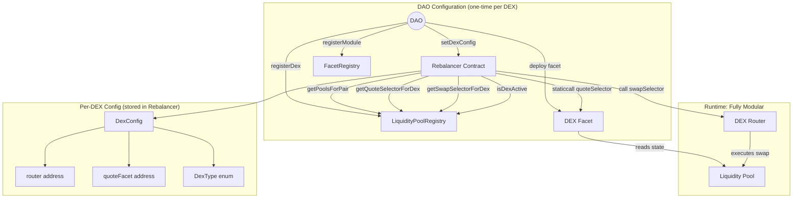
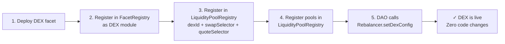
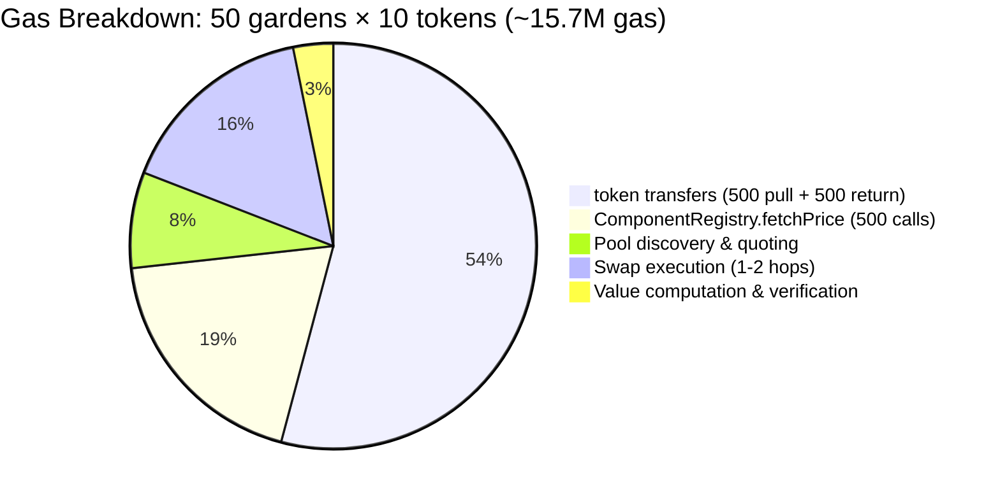

# Rebalancer — Flow Diagram

```mermaid
sequenceDiagram
    actor K as Keeper (anyone)
    participant R as Rebalancer
    participant FR as FacetRegistry
    participant IF as IndexFactory
    participant IC as IndexComponentRegistry
    participant LP as LiquidityPoolRegistry
    participant DF as DexFacet
    participant G1 as Garden₁
    participant G2 as Garden₂
    participant DEX as UniswapV3 / CamelotV2 Router
    participant Pool as Liquidity Pool

    Note over K,Pool: === Phase 0: Pre-conditions ===
    Note over R: 24h cooldown elapsed since last rebalance for this index type
    Note over G1,G2: Garden owners have pre-approved Rebalancer for all component tokens + USDC

    K->>R: cumulativeRebalance(keccak256("BLOKC2"))
    activate R

    rect rgb(240, 240, 255)
        Note over R: === Guard Checks ===
        R->>R: ✓ indices registered for type
        R->>R: ✓ 24h cooldown passed
        R->>R: ✓ _rebalancing[type] = true (reentrancy lock)
    end

    rect rgb(255, 245, 230)
        Note over R,LP: === Phase 1: Discover Gardens ===
        R->>R: indices = _indexTypeIndices["BLOKC2"]
        loop For each Index in type
            R->>R: Index.getConnectedGardens()
        end
        Note over R: gardens = [Garden₁, Garden₂, ...] (deduplicated)
        R->>R: symbols, weights = Index.getWeights()
        Note over R: symbols = [WETH, WBTC], weights = [0.5e18, 0.5e18]
    end

    rect rgb(230, 255, 230)
        Note over R,IC: === Phase 2: Snapshot & Pull Tokens ===
        loop For each garden
            loop For each symbol
                R->>IC: getComponentAddress(symbol)
                IC-->>R: token address
                R->>G1: IERC20(token).balanceOf(garden)
                G1-->>R: balance
                R->>IC: fetchPrice(symbol)
                IC-->>R: Chainlink price (8 decimals)
            end
            Note over R: gardenTotal = Σ(balance × price / 10^decimals)
            Note over R: contributions[i] = gardenTotal
        end
        Note over R: totalValueUsd = Σ contributions

        loop For each garden
            R->>G1: IERC20(WETH).transferFrom(garden, rebalancer, balance)
            activate G1
            G1-->>R: ✓ tokens pulled
            deactivate G1
            R->>G2: IERC20(WBTC).transferFrom(garden, rebalancer, balance)
            activate G2
            G2-->>R: ✓ tokens pulled
            deactivate G2
        end
        Note over R: All tokens now held by Rebalancer
    end

    rect rgb(255, 240, 240)
        Note over R,IC: === Phase 3: Compute Cumulative State ===
        loop For each symbol
            R->>R: balance = IERC20(token).balanceOf(address(this))
            R->>IC: fetchPrice(symbol)
            IC-->>R: price
            R->>R: currentValue[i] = balance × price / 10^decimals
        end
        R->>R: totalValue = Σ currentValues + USDC value
        loop For each symbol
            R->>R: targetValue[i] = totalValue × weight[i] / 1e18
        end
        Note over R: excess = {currentValue > targetValue + 2%}
        Note over R: deficit = {currentValue < targetValue + 2%}
    end

    rect rgb(255, 230, 255)
        Note over R,DEX: === Phase 4: Find Best Pools & Execute Swaps ===
        Note over R: Excess: WBTC ($3000 over target) → sell WBTC
        Note over R: Deficit: WETH ($3000 under target) → buy WETH

        R->>LP: getPoolsForPair(WBTC, WETH)
        LP-->>R: [] (no direct pool)

        Note over R: Route via USDC: WBTC → USDC → WETH

        R->>LP: getPoolsForPair(WBTC, USDC)
        LP-->>R: [Pool₀, Pool₁, Pool₂]

        loop For each pool
            R->>LP: getPool(pool)
            LP-->>R: PoolInfo(dexId, token0, token1)
            R->>LP: getQuoteSelectorForDex(dexId)
            LP-->>R: quoteSelector (e.g. camelotV2Quote.selector)
            R->>LP: isDexActive(dexId)
            LP-->>R: true

            R->>FR: validateSelector(swapSelector, INDEX_GARDEN)
            FR-->>R: (facetAddress, moduleAllowed)

            R->>DF: staticcall(quoteSelector, QuoteInstruction(pool, amountIn, [WBTC,USDC], false))
            activate DF
            DF->>Pool: getReserves() [V2] or slot0() [V3]
            Pool-->>DF: reserves / sqrtPriceX96
            DF-->>R: expectedOut
            deactivate DF
        end

        Note over R: Best pool: Pool₁ (Camelot V2) — highest expectedOut

        R->>R: minOut = expectedOut × 95% (5% slippage tolerance)
        R->>DEX: swapExactTokensForTokensSupportingFeeOnTransferTokens(amountIn, minOut, [WBTC,USDC], rebalancer, 0, deadline)
        activate DEX
        DEX->>Pool: swap
        Pool-->>DEX: amountOut
        DEX-->>R: ✓ WBTC → USDC swapped
        deactivate DEX

        Note over R: Phase 4b: Sweep USDC → deficit tokens
        R->>LP: getPoolsForPair(USDC, WETH)
        LP-->>R: [Pool₃]
        R->>DF: staticcall(quoteSelector, QuoteInstruction(Pool₃, usdcAmount, [USDC,WETH], false))
        DF-->>R: expectedOut
        R->>DEX: swap(usdcAmount, minOut, [USDC,WETH], rebalancer, ...)
        DEX-->>R: ✓ USDC → WETH swapped
    end

    rect rgb(255, 255, 220)
        Note over R: === Phase 5: Verify Value Preservation ===
        R->>R: valueAfter = Σ rebalancer token balances × price
        R->>R: minAcceptable = valueBefore × (100% - 0.5%)
        R->>R: assert(valueAfter >= minAcceptable)
    end

    rect rgb(240, 255, 240)
        Note over R,G2: === Phase 6: Proportional Redistribution ===
        Note over R: Snapshot original token balances

        loop For each garden (except last)
            R->>R: share = contributions[i] × 1e18 / totalValueUsd
            loop For each token
                R->>R: allocation = originalBalance × share / 1e18
                R->>G1: IERC20(token).transfer(garden, allocation)
            end
        end

        Note over R: Last garden sweeps all remaining dust
        R->>G2: IERC20(WETH).transfer(garden₂, allRemainingWETH)
        R->>G2: IERC20(WBTC).transfer(garden₂, allRemainingWBTC)
    end

    rect rgb(240, 240, 255)
        Note over R: === Phase 7: Finalize ===
        R->>R: lastRebalanceTimestamp[type] = block.timestamp
        R->>R: _rebalancing[type] = false
        R-->>K: emit CumulativRebalanceCompleted(type, gardenCount, timestamp, nextRebalance)
    end

    deactivate R
```

## Architecture: How DEXs are discovered

```mermaid
graph TB
    subgraph "DAO Configuration (one-time per DEX)"
        DAO((DAO)) -->|setDexConfig| RC[Rebalancer Contract]
        DAO -->|registerDex| LP[LiquidityPoolRegistry]
        DAO -->|registerModule| FR[FacetRegistry]
        DAO -->|deploy facet| DF[DEX Facet]
    end

    subgraph "Runtime: Fully Modular"
        RC -->|getPoolsForPair| LP
        RC -->|getQuoteSelectorForDex| LP
        RC -->|getSwapSelectorForDex| LP
        RC -->|isDexActive| LP
        RC -->|staticcall quoteSelector| DF
        RC -->|call swapSelector| RTR[DEX Router]
        DF -->|reads state| POOL[Liquidity Pool]
        RTR -->|executes swap| POOL
    end

    subgraph "Per-DEX Config (stored in Rebalancer)"
        CFG[DexConfig]
        CFG --> ROUTER[router address]
        CFG --> FACET[quoteFacet address]
        CFG --> TYPE[DexType enum]
    end

    RC --> CFG
```

## Modularity: Adding a new DEX

```mermaid
graph LR
    A[1. Deploy DEX facet] --> B[2. Register in FacetRegistry<br/>as DEX module]
    B --> C[3. Register in LiquidityPoolRegistry<br/>dexId + swapSelector + quoteSelector]
    C --> D[4. Register pools in<br/>LiquidityPoolRegistry]
    D --> E[5. DAO calls<br/>Rebalancer.setDexConfig]
    E --> F[✓ DEX is live<br/>Zero code changes]
```

## Gas flow per operation

```mermaid
pie title Gas Breakdown: 50 gardens × 10 tokens (~15.7M gas)
    "token transfers (500 pull + 500 return)" : 8.5
    "ComponentRegistry.fetchPrice (500 calls)" : 3.0
    "Pool discovery & quoting" : 1.2
    "Swap execution (1-2 hops)" : 2.5
    "Value computation & verification" : 0.5
```
